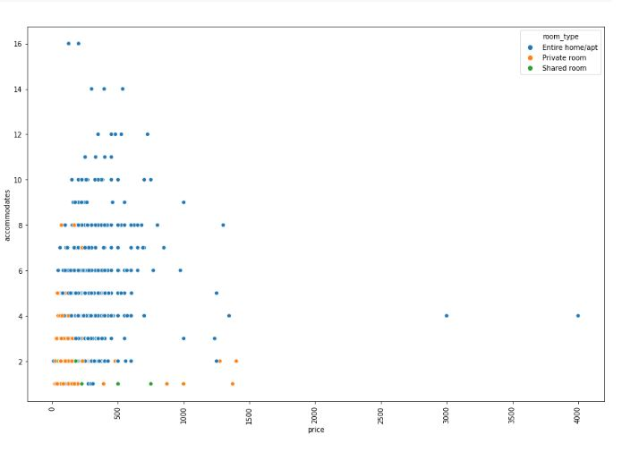
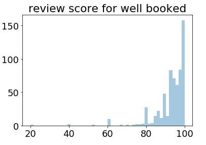

# Make Money by Airbnb?!

 

# Udacity project 1 Boston Airbnb data

 

Data Scientist Nanodegree Project 1
Data is provided by Kaggle Dataset https://www.kaggle.com/airbnb/boston/downloads/boston-airbnb-open-data.zip/1
Data size is too big to upload in Github repository.

# Table of Contents

1. [Why I analyze the data from Airbnb](#motivation)
2. [At first, how can you sell your peoperties?](#background)
3. [Questions for this data](#questions)
4. [File Descriptions](#files)
5. [Environment](#environment)
6. [Results](#results)
7. [Licensing, Authors, and Acknowledgements](#licensing)

---
# <a id="motivation" href="#motivation">Why I analyze the data from Airbnb</a>
I choose this data because I'm interested at sharing economy and big data. 
In 2020 Olympic will be held in Japan and existing hotels won't be enough for domestic and global tourists. 
Therefore, sharing houses have demands for solving that issues. Maybe this will be a fortune as your business.
Do you want to join Airbnb? Do you think you make money from this or not?
If you join Airbnb as a newbie, how do you start?

# <a id="background" href="#background">At first, how can you sell your peoperties?</a>
The most interesting thing must be ... whether you can get customers or not. Especially at the first time.
How do people who sells their properties well make the business? We will compare the tendency between well sold properties and the opposit.

# <a id="questions" href="#questions">Questions for this data</a>
## 1. What changes the price?
**We need to check correlation**
- largeness?
- location?

## 2. How can we get more money from AirBnB business?
 - distributions of properties price
 - 2-1) What makes more booked listings? or less booked listings?
     - cheap?
 - 2-2) What makes good review scores by customers?
 
# <a id="files" href="#files">File descriptions</a>
- `how-do-you-set-the-price-for-airbnb.ipynb` : Code for analysis. Run on jupyter notebook.
- `README.md` : You are reading now
- `_config.yml` : 

# <a id="environment" href="#environment">Envionment</a>
- python 3.x
- numpy
- pandas
- matplotlib
- seaborn
- Ipython.display

# <a id="results" href="#results">Results</a>
## Question 1 : What changes the price?
### Prices varies even if accommodations and type of room are the same.

 

- location(city), room_type and accommodates effect the change of prices.

 

## Question 2 : How can we get more money from AirBnB business?
 - Checked distributions of properties price
 - **2-1) What makes more booked listings? or less booked listings?**
     - We compared prices distribution between more booked and less booked properties.
     - Can be said properties with under 300 dollars are easier booked
     

 - **2-2) What makes good review scores by customers?**
  - Well booked and not well booked properties seems to have similar reviews....
    - A difference is about 2 points in mean
    - Minimum scores are the same
    - Standard deviation's difference is about 0.1 points

  - The ratio of scores over 90 is different from well booked and less booked.
    - about 67% of reviews for well booked is over 90
    - about 59% of reviews for less booked is over 90 

  - It might suggest that you can't judge how well the properties can be booked by just reviews.
  

 
 

# <a id="licensing" href="#licensing">Licensing, Authors, and Acknowledgements</a>
Credit to Airbnb for the data. You can find the Licensing for the data and other descriptive information at the Kaggle link available [here](https://www.kaggle.com/airbnb/boston). Otherwise, feel free to use the code here as you would like!
